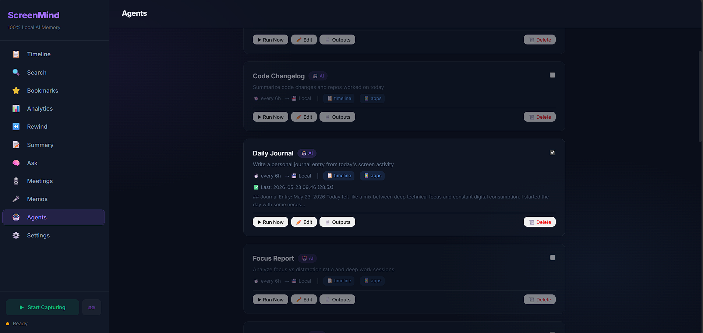

<div align="center">

<br>


<br><br>

**Captures your screen → Analyzes with Gemma 4 → Builds a searchable AI memory**<br>
**100% local. 100% private. Zero cloud dependencies.**

<br>

[](https://github.com/ayushh0110/ScreenMind/actions/workflows/ci.yml)
[](https://codecov.io/gh/ayushh0110/ScreenMind)
[](https://python.org)
[](https://ai.google.dev/gemma)
[](https://github.com/ggerganov/llama.cpp)
[](LICENSE)
[](MCP_SETUP.md)

<br>

[**Features**](#-features) · [**Comparison**](#-how-screenmind-compares) · [**Gemma 4 Deep Dive**](#-how-gemma-4-is-used) · [**Quick Start**](#-quick-start) · [**Architecture**](#-architecture) · [**Agent Platform**](#-agent-platform) · [**MCP**](#-mcp-server-claude--cursor--vs-code) · [**API**](#-api-reference)

<br>


| Agents | 
|:---:|
|  |

<br>

**💬 Chat in Action** — *Ask anything about your screen history*


</div>

<br>

> **Microsoft showed the world wants screen-aware AI with Recall.** But Recall stores data in plaintext, sends telemetry, and was met with massive privacy backlash. ScreenMind is the open-source, privacy-first alternative — every screenshot analyzed, every insight generated, every search result — all computed locally using Gemma 4's multimodal capabilities.
>
> It's not just a screen recorder. It's an **AI memory** you can talk to, search through, and build automations on top of.

---


## ✨ Features

### 🧠 Core Intelligence

- **📸 Smart Capture** — Content-change detection, not a fixed timer. Captures when your screen *actually* changes.
- **🔬 Gemma 4 Vision Analysis** — Every screenshot analyzed: app detection, activity categorization, mood, scene description, spatial layout regions.
- **🔍 Hybrid Search** — Semantic embeddings (MiniLM) + FTS5 keyword search. Find anything by *meaning*, not just keywords.
- **💬 Chat with Memory** — Conversational RAG with follow-up support. Ask "what did Alex say on Discord?" → get the actual message.
- **🧠 Model Hub** — In-app model download with live progress tracking. Chat and Summary are locked with witty brain animations until the model is ready — then auto-unlock. No terminal needed.
- **🎙️ Voice Memos** — Hold `Ctrl+Shift+V` → Gemma 4's native audio encoder transcribes. Screenshot captured alongside.
- **🎤 Meeting Transcription** — Auto-detects Zoom/Teams/Meet, records audio, transcribes, generates structured summaries.
- **📊 Analytics Dashboard** — Category breakdown, top apps, hourly heatmap, meeting stats, focus metrics.
- **⏪ Day Rewind** — Timelapse playback of your entire day with play/pause/scrub/speed controls.

### ⚡ Performance

- **Three Analysis Modes** — Accurate (~76s, deep thinking + layout), Balanced (~40s, thinking), or Fast (~12s, no thinking). You choose.
- **Per-App pHash Cache** — 3-tier caching with app-aware staleness. Communication apps refresh faster than IDEs. Significantly fewer inference calls.
- **Chat-First GPU Priority** — Chat cancels in-flight analysis instantly. GPU freed in <1s.
- **Auto-Pause Heavy Apps** — Games, video editors, 3D software detected → capture pauses automatically.

### 🔒 Privacy & Security

- **100% Local** — All data stays on your machine. Zero network calls after initial model download. No telemetry. Ever.
- **Sensitive Data Filter** — Auto-redacts credit cards, SSNs, API keys, passwords before storage.
- **Encryption at Rest** — AES encryption for screenshots (Fernet + OS keyring).
- **Dashboard PIN Lock** — Session-based auth with configurable auto-lock timeout.
- **Incognito Mode** — One-click pause. Nothing recorded.

<details>
<summary><b>🔌 Integrations & Extensibility</b></summary>

<br>

| Integration | Description |
|---|---|
| 🤖 **Agent Platform** | Build automations in Markdown (English) or Python. Drop a file, get an agent. |
| 🔌 **MCP Server** | Expose screen history to Claude Desktop, Cursor, VS Code |
| 📓 **Obsidian** | Auto-sync daily summaries to your vault |
| 📋 **Notion** | Push summaries to a Notion database |
| 🪝 **Webhooks** | Fire events to Slack, Discord, IFTTT (HMAC signed, auto-retry) |
| 🔔 **Smart Notifications** | Distraction alerts, break reminders |
| ⭐ **Auto-Bookmark** | Keyword triggers (`git push`, `deploy`) auto-flag important moments |

</details>

### ⌨️ System-Wide Hotkeys

| Hotkey | Action |
|---|---|
| `Ctrl+Shift+B` | 📸 Instant bookmarked capture |
| `Ctrl+Shift+P` | ⏸ Toggle pause/resume |
| `Ctrl+Shift+V` | 🎤 Hold to record voice memo |

> All hotkeys customizable from Settings.

---

## 📊 How ScreenMind Compares

| Feature | **ScreenMind** | **Screenpipe** | **Microsoft Recall** |
|---|---|---|---|
| **License** | ✅ MIT (fully open-source) | Source-available (commercial license required for business use) | Proprietary |
| **Cost** | ✅ Free forever | Free (personal) / Paid (commercial) | Requires $1000+ Copilot+ PC |
| **Privacy** | ✅ Zero network calls. Zero telemetry. Ever. | Local-first, optional cloud | Telemetry opt-in. Data stayed local after backlash. |
| **Min. hardware** | ✅ Any GPU ≥4GB VRAM (or CPU-only) | 8GB RAM, modern CPU | 40 TOPS NPU + 16GB RAM + BitLocker + Windows Hello |
| **AI architecture** | ✅ Single model — Gemma 4 does vision + audio + reasoning | Multiple models — OCR + Whisper + external LLM | Proprietary NPU model |
| **Audio/meetings** | ✅ Native — Gemma 4 audio encoder (no Whisper needed) | Whisper-based transcription | ❌ Not supported |
| **Smart capture** | ✅ pHash deduplication + idle detection + auto-pause for games | Event-driven (app switches, clicks) | Periodic snapshots |
| **Search** | ✅ Semantic (MiniLM embeddings) + FTS5 keyword — hybrid fusion | Semantic + keyword + a11y tree | Semantic only (NPU) |
| **Chat with memory** | ✅ Full conversational RAG with follow-ups and vision fallback | ❌ | ❌ |
| **Agent system** | ✅ No-code Markdown agents + Python SDK + MCP server | Pipes (TypeScript) + MCP | ❌ |
| **In-app Model Hub** | ✅ Download, switch, manage models from UI — no terminal | ❌ | ❌ |
| **Encryption** | ✅ AES (Fernet) + OS keyring | Optional | TPM + BitLocker |
| **PII auto-redaction** | ✅ Transparent regex — CC (Luhn-validated), SSN, API keys, passwords | AI-based PII model | Content filtering |
| **Integrations** | ✅ Obsidian · Notion · Webhooks · MCP | MCP, SDK (Tauri/Electron/Swift) | Windows ecosystem only |
| **Platform** | ✅ Windows · macOS · Linux (X11 + Wayland) | Windows · macOS · Linux | Windows 11 only (Copilot+ PCs) |

> **TL;DR:** ScreenMind is the only option that's fully MIT open-source, runs on any hardware (including a $150 GPU), handles vision + audio + reasoning with a single local model, and lets you actually *chat* with your screen memory.

---

## 🧠 How Gemma 4 Is Used

Gemma 4 E2B is not a bolt-on — it's architecturally load-bearing. ScreenMind uses **all three modalities**:

### 1. Vision — Screenshot Analysis
Every screenshot is sent to Gemma 4 with OCR context. It returns structured JSON:
- App name, activity category, summary, detailed context
- Mood classification, confidence score
- Rich scene description (every visible element inventoried)
- Layout regions (sidebar, chat area, toolbar boundaries)

**Three modes** *(benchmarked on GTX 1650 4GB — scales dramatically with better GPUs):*
- **Accurate** — single call with thinking (~76s). Best layout detection.
- **Balanced** — thinking enabled, analysis-only (~40s). Richer descriptions than Fast.
- **Fast** — no-thinking prefill trick (~12s). Layout via OCR clustering instead.

<details>
<summary><b>⚡ GPU Scaling — How fast on your hardware?</b></summary>

<br>

The numbers above are from a **GTX 1650 (4GB VRAM)** — a worst-case scenario where the model spills to CPU RAM. With more VRAM, the entire model fits on GPU and inference speeds up dramatically:

| GPU | VRAM | Bandwidth | Regime | ~Fast Mode | Why |
|---|---|---|---|---|---|
| **GTX 1650** *(baseline)* | 4 GB | ~190 GB/s | spilling | ~12s | CPU-bottlenecked, partial offload |
| **RTX 3060** | 12 GB | ~360 GB/s | full fit | ~3-4s | Spill eliminated — the big jump |
| **RTX 4060 Ti** | 16 GB | ~290 GB/s | full fit | ~2-3s | Fits easily, more compute for vision |
| **RTX 3090** | 24 GB | ~935 GB/s | full fit | ~1-2s | High bandwidth |
| **RTX 4090** | 24 GB | ~1000 GB/s | full fit | ~1s | Top consumer card |

> **Key insight:** The biggest jump is from "spilling" (model doesn't fit in VRAM) to "full fit" (it does). Any GPU with ≥6GB VRAM should run E2B entirely on GPU and see 3-5x speedup over the baseline.

</details>

### 2. Audio — Voice Memos & Meeting Transcription
Gemma 4 E2B has a native audio encoder. ScreenMind uses it for:
- Voice memo transcription (hold hotkey → speak → release)
- Meeting transcription (15s chunks, map-reduce summarization for long meetings)

No Whisper dependency. One model handles everything.

### 3. Reasoning — Summaries, Chat, Agents
- **Daily summaries** with deep reasoning (`think=True`)
- **Chat answers** grounded in actual screen data (text-first RAG with vision fallback)
- **Agent execution** — Gemma processes markdown agent prompts with injected screen data

### Why E2B Specifically?

| Constraint | Why It Rules Out Alternatives |
|---|---|
| Must run **continuously in background** | Rules out 12B+ models (too heavy) |
| Must understand **screenshots natively** | Rules out text-only models |
| Must stay **100% local** for privacy | Rules out cloud APIs |
| Must handle **audio natively** | Rules out models without audio encoder |
| Must be **fast enough** for 30s cycle | E2B: 12-76s on GTX 1650, ~1-4s on RTX 3060+ |

Gemma 4 E2B is the only model that checks all five boxes.

---

## 🚀 Quick Start

> **Requirements:** Python 3.10+ · GPU recommended (4GB+ VRAM) · ~5GB disk for model

#### 1️⃣ Clone & Install

```bash
git clone https://github.com/ayushh0110/ScreenMind.git
cd ScreenMind

python -m venv venv
venv\Scripts\activate        # Windows
# source venv/bin/activate   # macOS/Linux

pip install -r requirements.txt
```

#### 2️⃣ Run

```bash
python -m screenmind
```

#### 3️⃣ Open → **http://127.0.0.1:7777** 

On first run, ScreenMind will:
- Auto-detect your GPU and download `llama-server` if not found (CUDA/CPU auto-selected)
- Open the **Model Hub** — download Gemma 4 E2B GGUF (~5GB) with progress tracking right in the UI
- Chat and Summary stay locked (🧠💤 *"I need my brain to think!"*) until the model is ready, then auto-unlock
- Start `llama-server` in background
- Show the welcome screen to set up an optional PIN
- Create `~/.screenmind/` for data storage

<details>
<summary><b>⚙️ Optional: Configure via .env</b></summary>

<br>

```bash
cp .env.example .env
# Edit capture interval, blocked apps, hotkeys, etc.
```

Or configure everything from the **Settings** tab in the dashboard.

</details>

---

## 🏗️ Architecture

> For a full deep-dive into threading, caching, search internals, and the privacy pipeline, see [**ARCHITECTURE.md**](ARCHITECTURE.md).

```
┌─────────────────────────────────────────────────────────────────────┐
│                          ScreenMind                                  │
│                                                                     │
│  ┌────────────┐    ┌──────────────┐    ┌─────────────────────────┐ │
│  │  Capture   │───▶│  Async Queue │───▶│    Analysis Worker      │ │
│  │  Worker    │    │  (max: 100)  │    │                         │ │
│  │            │    └──────────────┘    │  ┌───────────────────┐  │ │
│  │ • Screen   │                        │  │  Per-App pHash    │  │ │
│  │ • Window   │                        │  │  Cache (3-tier)   │  │ │
│  │ • Dedup    │                        │  └───────────────────┘  │ │
│  │ • A11y     │                        │           │             │ │
│  │ • Privacy  │                        │           ▼             │ │
│  └────────────┘                        │  ┌───────────────────┐  │ │
│                                        │  │   EasyOCR         │  │ │
│  ┌────────────┐                        │  │   (text extract)  │  │ │
│  │   Audio    │                        │  └───────────────────┘  │ │
│  │   Worker   │                        │           │             │ │
│  │            │                        │           ▼             │ │
│  │ • Meeting  │                        │  ┌───────────────────┐  │ │
│  │   detect   │                        │  │   Gemma 4 E2B     │  │ │
│  │ • Record   │                        │  │   (via llama.cpp) │  │ │
│  │ • Transcr. │                        │  │   Vision + Audio  │  │ │
│  └────────────┘                        │  └───────────────────┘  │ │
│                                        │           │             │ │
│  ┌────────────┐                        │           ▼             │ │
│  │   Agent    │                        │  ┌───────────────────┐  │ │
│  │  Scheduler │                        │  │  Layout Analyzer  │  │ │
│  │            │                        │  │  (spatial OCR)    │  │ │
│  │ • .md AI   │                        │  └───────────────────┘  │ │
│  │ • .py code │                        │           │             │ │
│  └────────────┘                        │           ▼             │ │
│                                        │  ┌───────────────────┐  │ │
│                                        │  │  MiniLM-L6-v2     │  │ │
│                                        │  │  (embeddings)     │  │ │
│                                        │  └───────────────────┘  │ │
│                                        └─────────────────────────┘ │
│                                                    │               │
│                                                    ▼               │
│                                        ┌───────────────────┐       │
│                                        │   SQLite (WAL)    │       │
│                                        │   + FTS5 index    │       │
│                                        └─────────┬─────────┘       │
│                                                  │                 │
│  ┌───────────────────────────────────────────────┘                 │
│  │                                                                 │
│  ▼                                                                 │
│  ┌───────────────────────────────────────────────────────────────┐ │
│  │                    FastAPI REST Server                         │ │
│  │  /timeline · /search · /chat · /stats · /agents · /mcp       │ │
│  │                                                               │ │
│  │  ┌───────────────────────────────────────────────────────┐   │ │
│  │  │           Web Dashboard (Vanilla JS SPA)               │   │ │
│  │  │  Timeline · Chat · Search · Analytics · Agents · Settings │ │
│  │  └───────────────────────────────────────────────────────┘   │ │
│  └───────────────────────────────────────────────────────────────┘ │
└─────────────────────────────────────────────────────────────────────┘
```

### Multi-Model AI Pipeline

```
Screenshot → EasyOCR (text) → Gemma 4 E2B (understanding) → MiniLM (embeddings) → SQLite + FTS5
                                     ↑
                              OCR text fed as context
                              (Gemma sees image + reads text)
```

Four AI models working in concert, with Gemma 4 as the brain:
1. **EasyOCR** — extracts raw screen text
2. **Gemma 4 E2B** — understands what you're doing (vision + reasoning)
3. **MiniLM-L6-v2** — generates semantic vectors for natural language search
4. **FTS5** — indexes text for instant keyword search

---

## 🤖 Agent Platform

ScreenMind includes a full agent/plugin system. Build any automation on top of your screen data.

### Two Modes

| Mode | File Type | For | Example |
|---|---|---|---|
| 🤖 AI Agent | `.md` | Everyone | Write a prompt in English → Gemma runs it on your data |
| 🐍 Python Plugin | `.py` | Developers | Full code with SDK access, state persistence, LLM calls |

### Markdown Agent Example

```markdown
---
name: Daily Focus Report
schedule: every 6h
data: timeline, apps, mood
output: local, obsidian
---

Analyze my screen activity and generate a focus report:
- How many hours of deep work vs shallow work?
- What were my main distractions?
- Give me a focus score out of 10.
```

Drop this file in `~/.screenmind/agents/` — it runs automatically.

### Python Plugin SDK

```python
from screenmind.screenmind_sdk import ScreenMindSDK

sdk = ScreenMindSDK("my-tracker")

# Get today's activities filtered by app
activities = sdk.get_activities(app="Chrome", limit=20)

# Persistent state across runs
last_count = sdk.load_state("url_count", 0)
urls = sdk.get_urls_visited()
sdk.save_state("url_count", len(urls))

# Ask Gemma (GPU-safe — waits for idle)
insight = sdk.ask_gemma(f"Summarize these URLs: {urls}")
print(insight)
```

### Data Selectors (Frontmatter)

Markdown agents declare what data they need:

| Selector | Injects |
|---|---|
| `timeline` | Recent activities with timestamps, apps, summaries |
| `apps` | App usage counts + category breakdown |
| `urls` | URLs visited (extracted from browser address bars) |
| `meetings` | Meeting summaries and durations |
| `mood` | Mood/sentiment from screen analysis |

Data injection auto-scales to your model's context window.

### 4 Agents Ship Built-In

- **daily-journal.md** — First-person journal entry from your day
- **focus-report.md** — Focus score, deep work hours, distractions
- **meeting-actions.md** — Extract action items from meeting transcripts
- **code-changelog.md** — Summarize coding activity (commits, files, repos)

---

## 🔌 MCP Server (Claude / Cursor / VS Code)

ScreenMind exposes your screen history to any MCP-compatible AI tool:

```bash
python -m screenmind.mcp_server  # stdio transport
```

**Claude Desktop config** (`~/.claude/claude_desktop_config.json`):
```json
{
  "mcpServers": {
    "screenmind": {
      "command": "python",
      "args": ["C:/path/to/screenmind/mcp_server.py"]
    }
  }
}
```

### Tools Available

| Tool | Description |
|---|---|
| `search_screen` | Semantic + keyword search across all history |
| `get_recent_activity` | Last N activities with full details |
| `get_activity_by_time` | Activities for a specific date/time range |
| `get_daily_summary` | AI-generated daily summary |
| `capture_now` | Trigger instant screenshot |
| `get_stats` | Usage statistics |
| `search_audio` | Search meeting transcripts |
| `get_screenshot` | Retrieve screenshot path by activity ID |

---

## 📡 API Reference

Full Swagger docs at `http://127.0.0.1:7777/docs`

### Key Endpoints

| Method | Endpoint | Description |
|--------|----------|-------------|
| `GET` | `/api/status` | System health, worker stats |
| `GET` | `/api/timeline?date=2026-05-21` | Activities for a date |
| `GET` | `/api/search?q=debugging auth` | Hybrid semantic + keyword search |
| `POST` | `/api/chat` | Conversational AI with screen memory (SSE stream) |
| `GET` | `/api/stats?range=day` | Analytics (categories, apps, meetings) |
| `GET` | `/api/rewind?date=2026-05-21` | Timelapse frames |
| `POST` | `/api/summary/generate` | Generate AI daily summary |
| `GET` | `/api/agents` | List all agents |
| `POST` | `/api/agents/{name}/run` | Trigger agent execution |
| `POST` | `/api/capture/pause` | Pause capture |
| `POST` | `/api/incognito/toggle` | Toggle incognito mode |

---

<details>
<summary><h2>⚙️ Configuration</h2></summary>

<br>

All settings configurable via `.env`, environment variables, or the **Settings** dashboard (persists to `settings.json`).

| Variable | Default | Description |
|----------|---------|-------------|
| `CAPTURE_INTERVAL` | `40` | Seconds between captures |
| `ANALYSIS_MODE` | `merged` | `merged` (accurate, ~76s) or `fast` (~12s) |
| `PERFORMANCE_MODE` | `balanced` | GPU layers: `minimal` / `balanced` / `maximum` |
| `BLOCKED_APPS` | *(empty)* | Comma-separated apps to never capture |
| `MEETING_TRANSCRIPTION` | `false` | Auto-transcribe when meeting apps detected |
| `RETENTION_DAYS` | `7` | Auto-delete data older than N days (0 = forever) |
| `ENCRYPTION_ENABLED` | `false` | Encrypt screenshots at rest |
| `SENSITIVE_FILTER_ENABLED` | `true` | Redact credit cards, SSNs, API keys |
| `SCREENMIND_LOG_LEVEL` | `INFO` | Log verbosity: `DEBUG`, `INFO`, `WARNING`, `ERROR` |
| `SCREENMIND_LOG_FILE` | *(none)* | Path to a log file (rotating, 10MB × 3 backups) |

> See `.env.example` for the full list.

</details>

---

## 🔧 Tech Stack

| Layer | Technology | Why |
|-------|-----------|-----|
| **Vision + Audio AI** | Gemma 4 E2B (via llama.cpp) | Only model with vision + audio + reasoning that runs locally on 4GB VRAM |
| **Inference Server** | llama-server (llama.cpp) | Direct GGUF inference, OpenAI-compatible API |
| **OCR** | EasyOCR | Extracts screen text fed to Gemma as context |
| **Embeddings** | all-MiniLM-L6-v2 | 80MB, runs on CPU, 384-dim vectors for semantic search |
| **Backend** | FastAPI + Uvicorn | Async-first, auto-generated API docs |
| **Database** | SQLite (WAL) + FTS5 | Zero-config, concurrent reads, full-text search |
| **Capture** | mss + ctypes/UI Automation | Native screen capture + accessibility text extraction |
| **Wayland Capture** | grim (wlroots) / XDG Portal | Automatic fallback; no X11 dependency on Wayland |
| **Frontend** | Vanilla JS + CSS | No build step, instant load, dark glassmorphism UI |
| **Platform** | Windows / macOS / Linux (X11 + Wayland) | Abstraction layer with OS-specific adapters |

---

### 🐧 Wayland Support

ScreenMind auto-detects Wayland sessions and uses compositor-native capture:

| Compositor | Capture | Window Detection | Notes |
|---|---|---|---|
| **Sway** | ✅ grim | ✅ swaymsg IPC | Full support |
| **Hyprland** | ✅ grim | ✅ hyprctl IPC | Full support |
| **Niri** | ✅ grim | ✅ niri msg IPC | Full support |
| **river / Wayfire / labwc** | ✅ grim | ⚠️ Title only (no IPC) | Capture works, app name may be unavailable |
| **GNOME (Mutter)** | ⚠️ XDG Portal | ❌ No IPC available | Portal prompts on every capture — not viable for background recording |
| **KDE (KWin)** | ⚠️ XDG Portal | ❌ No IPC available | Same as GNOME |

**Install grim** (recommended for wlroots compositors):
```bash
# Arch
sudo pacman -S grim

# Ubuntu / Debian (if available)
sudo apt install grim

# Fedora
sudo dnf install grim
```

**GNOME / KDE Wayland**: Best-effort only. Screenshots use the XDG Desktop Portal,
which prompts for permission on each capture — not viable for continuous background
recording. For full functionality, use an X11 session or a wlroots-based compositor with grim.

**Optional** (for portal fallback): `python3-gi` / `python-gobject` system package.

---

<details>
<summary><h2>📁 Project Structure</h2></summary>

<br>

```
screenmind/
├── screenmind/                    # Entry point — starts all services
├── config.py                  # Pydantic settings (env + runtime overrides)
├── setup_llama.py             # Auto-detect + install llama-server
├── requirements.txt           # Full Python dependencies
├── requirements-test.txt      # Lightweight CI deps (no PyTorch)
│   ├── main.py              # MCP server for Claude/Cursor/VS Code
├── screenmind_sdk.py          # SDK for Python plugin agents
│
│   ├── capture/                   # Screenshot capture layer
│   ├── screen.py              # Capture facade (mss / Wayland backend)
│   ├── wayland.py             # Wayland backend (grim / XDG Portal)
│   ├── window.py              # Active window detection
│   ├── dedup.py               # Perceptual hash deduplication
│   ├── hotkey.py              # Global hotkeys (bookmark, pause, voice)
│   └── voice_recorder.py      # Mic recording for voice memos
│
│   ├── engine/                    # AI & intelligence layer
│   ├── analyzer.py            # Gemma 4 vision analysis (dual mode)
│   ├── llm_client.py          # llama-server client (chat, vision, audio)
│   ├── model_manager.py       # Server lifecycle, model download/switch
│   ├── embedder.py            # MiniLM semantic embeddings
│   ├── ocr.py                 # EasyOCR text extraction
│   ├── layout_analyzer.py     # Spatial OCR organization
│   ├── dev_context.py         # Git repo/branch/diff detection
│   ├── a11y_extractor.py      # Accessibility API text extraction
│   └── agent_runner.py        # Agent scheduling & execution
│
│   ├── workers/                   # Background processing
│   ├── capture_worker.py      # Smart capture loop + privacy filtering
│   ├── analysis_worker.py     # OCR → Gemma → Layout → Embed → Store
│   └── audio_worker.py        # Meeting detection & transcription
│
│   ├── storage/                   # Data persistence
│   ├── database.py            # SQLite + FTS5 + migrations
│   └── models.py              # Pydantic data models
│
│   ├── privacy/                   # Privacy & security
│   ├── encryption.py          # Fernet AES encryption at rest
│   └── data_filter.py         # Sensitive data redaction
│
│   ├── platform_support/          # Cross-platform abstraction
│   ├── windows.py             # Win32 + UI Automation
│   ├── macos.py               # AppKit + AXUIElement
│   └── linux.py               # xdotool + AT-SPI
│
│   ├── integrations/              # External connections
│   ├── obsidian.py            # Vault markdown export
│   ├── notion.py              # Notion API export
│   ├── webhooks.py            # HTTP webhooks (HMAC, retry)
│   └── smart_notify.py        # Distraction/break notifications
│
│   ├── api/                       # REST API + dashboard
│   ├── server.py              # FastAPI app + auth middleware
│   ├── dependencies.py        # Shared state for routes
│   ├── routes/                # 16 route modules
│   └── static/                # Web dashboard (HTML + CSS + JS)
│
├── default_agents/            # 4 built-in agents
│   ├── daily-journal.md
│   ├── focus-report.md
│   ├── meeting-actions.md
│   └── code-changelog.md
│
├── tests/                     # pytest test suite (25 modules)
│   ├── conftest.py            # Shared fixtures
│   └── test_*.py              # Unit + integration tests
│
└── docs/
    └── BUILD_YOUR_OWN_AGENT.md
```

</details>

---

## 🛡️ Error Handling & Resilience

| Scenario | Behavior |
|----------|----------|
| **llama-server not found** | Auto-downloads correct binary from GitHub releases (CUDA/CPU auto-detected). Checks disk space first. |
| **Model not downloaded** | Model Hub shows lock screen with download cards. Progress tracked in UI. Chat/Summary locked until ready. |
| **GPU out of memory** | Detects OOM, retries with delay, re-queues on persistent failure. |
| **Duplicate frames** | pHash dedup skips identical screenshots (threshold: 8 hamming distance). |
| **Stale queue items** | Captures >3 min old auto-skipped. Backfilled during idle. |
| **App in blocklist** | Silently skips — no screenshot saved. |
| **Meeting app closed** | Process-alive check + silence detection + 5-min hard timeout. |
| **Chat during analysis** | Cancels in-flight inference, frees GPU in <1s, re-queues analysis. |
| **Crash recovery** | Stale meetings cleaned on startup. Unanalyzed entries backfilled. |

---

## 🎨 Dashboard

The web dashboard at `http://127.0.0.1:7777` features:

- **Timeline** — Browse activities by date with thumbnails, AI summaries, category badges
- **Chat** — Conversational AI with screen memory. Ask anything about your history. Locked with 🧠💤 brain animation until model is ready.
- **Search** — Semantic + keyword hybrid search with OCR highlighting on screenshots
- **Analytics** — Category charts, top apps, hourly heatmap, meeting stats
- **Rewind** — Timelapse player with play/pause/scrub/speed controls
- **Memos** — Voice memo list with audio player
- **Agents** — Create, edit, run, and monitor agents
- **Settings** — Model Hub (download/switch models with progress), Shortcuts, Capture, AI, Audio, Privacy, Automation, Integrations, Storage

Dark glassmorphism UI. No build step. Instant load.

---

## 🧪 Development

Run the test suite:

```bash
# Fast (lightweight deps — same as CI, ~2 min install)
pip install -r requirements-test.txt
pytest --cov=. --cov-report=term-missing -q

# Full (includes ML models — sentence-transformers, easyocr)
pip install -r requirements.txt
pip install pytest pytest-asyncio pytest-cov
pytest --cov=. --cov-report=term-missing -q
```

CI runs automatically on push/PR via GitHub Actions using the lightweight deps.

---

## 🤝 Contributing

Contributions welcome! Here are some high-impact areas:

- 🍎 **macOS/Linux testing** — platform adapters exist, need real hardware testing
- 🐳 **Docker container** — one-command setup
- 🧩 **Community agent registry** — share agents between users
- 🌐 **Browser extension** — richer URL/tab context
- 📤 **Export formats** — Markdown, CSV, JSON

---

## ⭐ Show Your Support

If you find ScreenMind useful, please consider:

- **⭐ Star this repo** — it helps others discover the project
- **🍴 Fork it** — build your own agents and features
- **🐛 Report issues** — help us improve
- **📣 Share it** — tell others about privacy-first AI

<div align="center">

<br>

<a href="https://github.com/ayushh0110/ScreenMind/stargazers"></a>
<a href="https://github.com/ayushh0110/ScreenMind/network/members"></a>

<br>

</div>

---

## 📝 License

MIT License — see [LICENSE](LICENSE) for details.

---

<div align="center">

<br>

**Built with 🧠 Gemma 4 E2B · 🔒 100% Local · 🚀 Zero Cloud Dependencies**

*Vision + Audio + Reasoning — all three modalities, one model, your machine.*

<br>

<sub>Made with ❤️ by <a href="https://github.com/ayushh0110">ayushh0110</a></sub>

</div>
